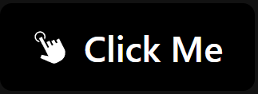

## **builtin-ui-react**

#### This library provides some built-in React Components with pre-defined styles which helps to create layout of a Web Application faster and easier.

#### Each Component is easily customizable so you can give different Tailwind CSS styles to it of your choice.

### Currently Available Built-in Components :

`Button`
`Input Box`

### Code Example :

`<Button /> Component` :

> `text` : This Prop takes the **_Name for the Button_**.
> <br>
> `image`: This Prop takes the **_Image for the Button_**.
> <br>
> `click`: This Prop takes the **_On Click method for the Button_**.
> <br>
> `style`: This Prop takes the **_Custom Tailwind CSS Classes for the Button_**.
> <br><br>
> `All above Props are Optional, if we doesn't passed any props, it will create empty button for us`.

```js
import { Button } from "builtin-ui-react";
import { GiClick } from "react-icons/gi";

const Home = () => {
    return(
        <Button
            text="Click Me"
            image={<GiClick />}
            click={() => alert("Hello World")}
            style="bg-black text-white"
        />;
    );
};

export default Home;
```
### Output :


`<Input /> Component` :

> `inputType` : This Prop takes the **_type of Input field only for these input types (text, email, password)_**.
> <br>
> `inputRef`: This Prop takes the **_ref of useRef Hook_**.
> <br>
> `inputPlaceholder`: This Prop takes the **_placeholder for the input field_**.
> <br>
> `inputValue`: This Prop takes the **_value for the input field helpful for useState Hook_**.
> <br>
> `onInputChange`: This Prop takes the **_method for change in input value_**.
> <br>
> `inputStyle`: This Prop takes the **_Custom Tailwind CSS Classes for the Input Field_**.
> <br>
> `icon`: This Prop takes the **_Custom Icon for the Input Field_**.
> <br>
> `iconStyle`: This Prop takes the **_Custom Icon Tailwind CSS for the Input Field_**.
> <br><br>
> `All above Props are Optional, if we doesn't passed any props, it will create empty input field for us`.

```js
import { Input } from "builtin-ui-react";
import { FaUser } from "react-icons/fa";

const Home = () => {
  return (
    <Input
      inputType="text"
      inputRef={userRef}
      inputPlaceholder="Name"
      inputValue={userVal}
      onInputChange={inputChange}
      inputStyle="bg-black text-white"
      icon={<FaUser />}
      iconStyle="bg-black text-white"
    />
  );
};

export default Home;
```

### Output :


